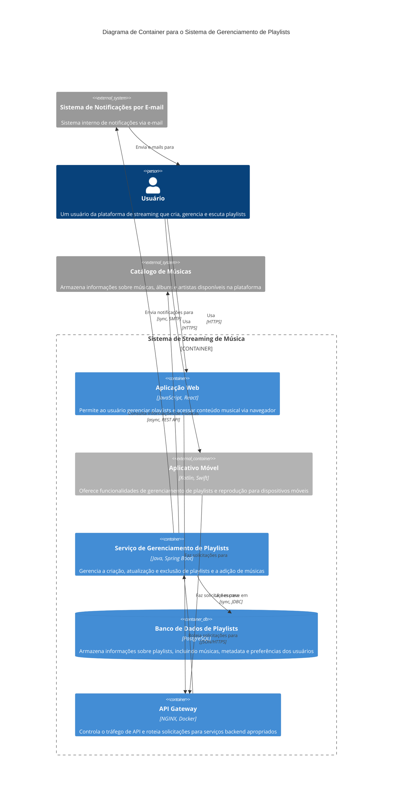
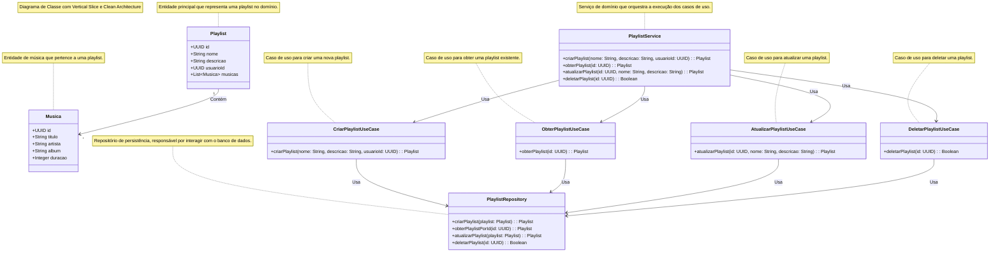
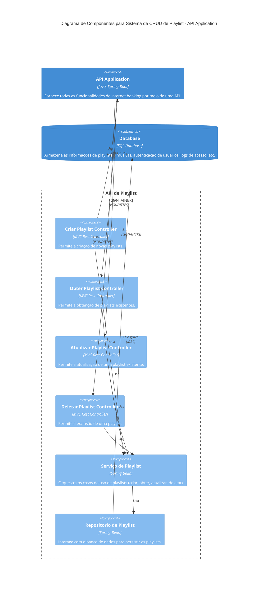
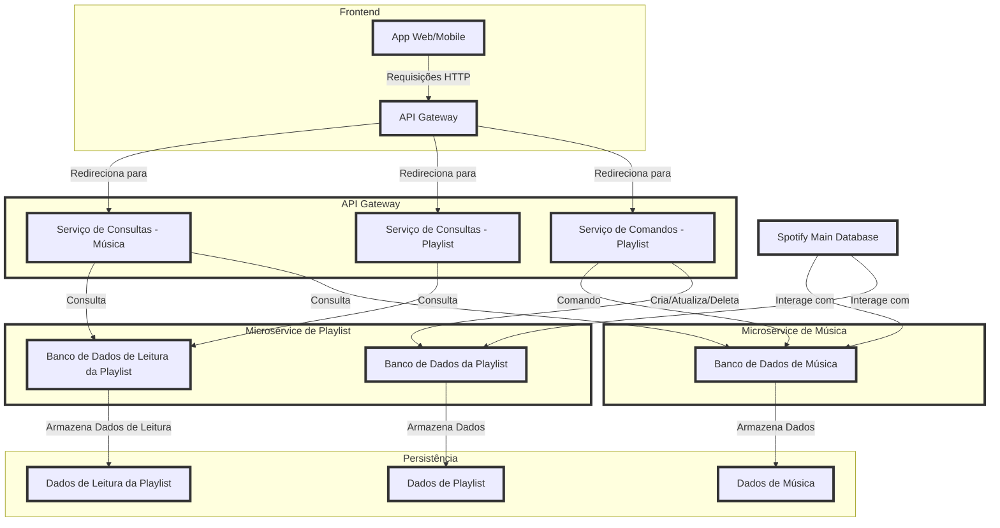

# System Design - CRUD de Playlist no Spotify

## Índice

1.  [Visão Geral do Sistema](#vis%C3%A3o-geral-do-sistema)
2.  [Requisitos do Sistema](#requisitos-do-sistema)
3.  [Decisões Arquiteturais](#decis%C3%B5es-arquiteturais)
4.  [C4 Model - Level 1 (Contexto do Sistema)](#c4-model---level-1-contexto-do-sistema)
5.  [C4 Model - Level 2 (Container do Sistema)](#c4-model---level-2-container-do-sistema)
6.  [Padrões Arquiteturais](#padrões-arquiteturais)
7.  [Diagrama de Classes](#diagrama-de-classes)
8.  [Diagrama de Componentes](#diagrama-de-componentes)

## Visão Geral do Sistema

Este sistema foi projetado para gerenciar playlists de música para usuários da plataforma Spotify. A funcionalidade CRUD para playlists permite que os usuários criem novas playlists, visualizem playlists existentes, façam alterações, e excluam playlists indesejadas.

## Requisitos do Sistema

### Funcionais

-   Criar uma playlist com um nome e descrição.
-   Adicionar ou remover músicas da playlist.
-   Exibir informações da playlist para o usuário, incluindo lista de músicas.
-   Permitir que o usuário atualize informações da playlist.
-   Excluir playlists específicas.

### Não Funcionais

-   Escalabilidade para suportar milhões de usuários simultâneos.
-   Baixa latência para proporcionar uma experiência fluida.
-   Alta disponibilidade e tolerância a falhas para não interromper o serviço.
-   Segurança e controle de acesso para garantir que somente o proprietário possa modificar a playlist.

## Decisões Arquiteturais

### Estilos Arquiteturais

-   **Microserviços** para decompor o sistema em serviços menores e independentes.
-   **RESTful APIs** para comunicação entre os serviços.
-   **Event-Driven Architecture** para tratar atualizações de playlists e sincronizar dados em tempo real entre dispositivos.

### Padrões de Projeto

-   **Repository Pattern** para a camada de acesso a dados de playlists e músicas.
-   **DTO (Data Transfer Objects)** para transferir dados entre camadas.
-   **Factory Pattern** para instâncias complexas de playlist.

----------

## C4 Model - Level 1 (Contexto do Sistema)
´´´mermaid
C4Context

title Diagrama de Contexto do Sistema de Gerenciamento de Playlists

Enterprise_Boundary(b0, "Limite do Serviço de Streaming") {

  Person(user, "Usuário do Spotify", "Um usuário da plataforma que cria, gerencia e escuta playlists.")

  System(playlistSystem, "Sistema de Gerenciamento de Playlists", "Permite que os usuários criem, visualizem, editem e excluam playlists com suas músicas favoritas.")

  Enterprise_Boundary(b1, "Backend do Spotify") {

    SystemDb_Ext(mainMusicDatabase, "Banco de Dados Principal de Músicas", "Armazena todas as informações principais sobre músicas, álbuns e artistas disponíveis na plataforma.")
    
    System_Boundary(b2, "Limite de Gerenciamento de Usuários") {
      System(userAuthSystem, "Sistema de Autenticação de Usuários", "Gerencia o login de usuários e controle de acesso.")
      System(userProfileSystem, "Sistema de Perfil de Usuários", "Armazena dados específicos do usuário, como preferências e metadados das playlists.")
    }

    System_Ext(emailSystem, "Sistema de Notificações por E-mail", "Envia notificações para os usuários quando as playlists são modificadas.")
    
    Boundary(b3, "Limite de Streaming de Músicas", "limite") {
      SystemQueue(playbackQueue, "Fila de Reprodução de Músicas", "Gerencia solicitações de streaming de músicas.")
      SystemQueue_Ext(eventQueue, "Fila de Registro de Eventos", "Registra ações dos usuários, como edições de playlists para análise e personalização.")
    }
  }
}

BiRel(user, playlistSystem, "Usa")
BiRel(playlistSystem, mainMusicDatabase, "Busca metadados das músicas")
Rel(playlistSystem, emailSystem, "Envia notificações", "SMTP")
Rel(emailSystem, user, "Envia e-mails para")

UpdateElementStyle(user, $fontColor="black", $bgColor="lightyellow", $borderColor="black")
UpdateRelStyle(user, playlistSystem, $textColor="green", $lineColor="green", $offsetX="5")
UpdateRelStyle(playlistSystem, mainMusicDatabase, $textColor="blue", $lineColor="blue", $offsetY="-10")
UpdateRelStyle(playlistSystem, emailSystem, $textColor="blue", $lineColor="blue", $offsetY="-40", $offsetX="-50")
UpdateRelStyle(emailSystem, user, $textColor="purple", $lineColor="purple", $offsetX="-50", $offsetY="20")

UpdateLayoutConfig($c4ShapeInRow="3", $c4BoundaryInRow="1")

´´´
----------

## C4 Model - Level 2 (Container do Sistema)

---
## Padrões Arquiteturais

-   **Microserviços:** para dividir o sistema em serviços independentes e escaláveis.
-   **Event-Driven Architecture:** para sincronização em tempo real e notificação de atualizações em playlists.
-   **CQRS (Command Query Responsibility Segregation):** para otimizar comandos de criação e atualização, e consultas de leitura.
---
## Diagrama de Classes

---
## Diagrama de Componentes

## System Design

